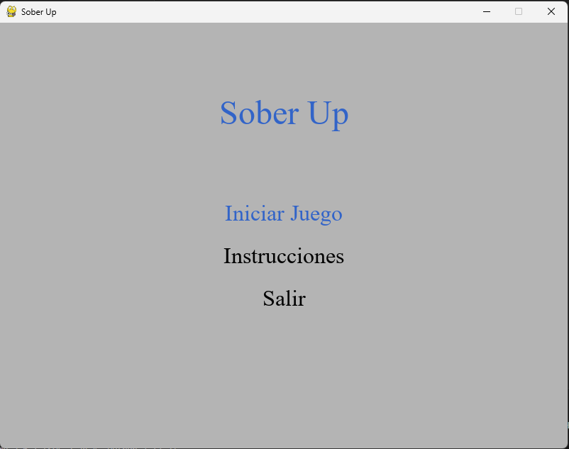

# 🕹️ Sober Up

**Sober Up** es un mini-juego en 2D desarrollado en **Python** usando la biblioteca **Pygame**. Nustro juego trata sobre un personaje que se encuentra en el problema de la drogadiccion y el protagonista se ve involiucrado en el mundo de las drogas pero llega un momento en el que decide tomar control de su vida, y se logra presenciar el recorrido que el personaje hace, pasando distintas dificultades para lograr salir de este mundo.

---

## 📸 Capturas de pantalla



---

## 🎮 Dinámica del juego

- Te mueves por el mapa con las teclas **W, A, S, D** o las **flechas del teclado**.
- Si estás cerca del cuchillo y presionas **H**, lo recoges.
- Puedes soltar el cuchillo presionando **H** nuevamente.
- El cuchillo se dibuja en la mano del personaje cuando lo llevas.
- El sprite del personaje cambia según la dirección en la que se mueve.

---

## 🧰 Cómo instalar y ejecutar el juego

### 1. Clona el repositorio

```bash
git clone https://github.com/tu-usuario/sober-up.git
cd sober-up

### Instala las dependencias
pip install pygame

### Ejecuta el juego
python main.py

